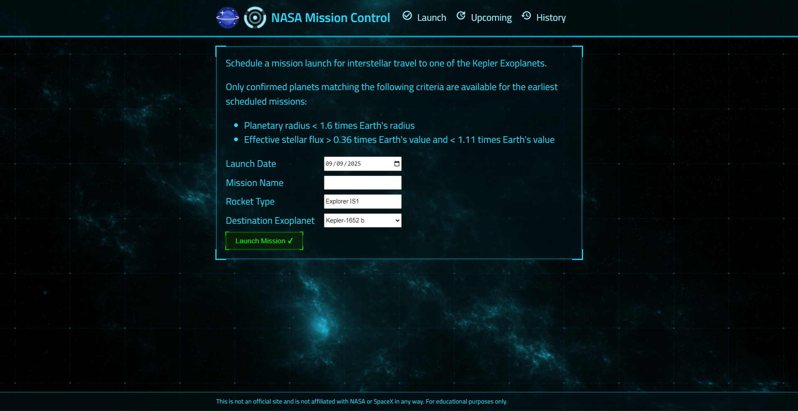

# NASA Mission Control 🚀

NASA Mission Control is an interactive web app that lets users explore and manage NASA missions data. The platform combines real-time data fetching, smooth animations, and an immersive interface to provide an engaging experience for space enthusiasts and researchers alike.

## Technologies Used

- ⚛️ **React.js**: A powerful library for building interactive user interfaces.
- 🌌 **Arwes**: Futuristic UI framework for sci-fi inspired designs and animations.
- 🔄 **Axios**: Simplified HTTP requests to fetch NASA data.
- 🌐 **CORS**: Proper cross-origin handling for API requests.
- 📂 **csv-parser**: Efficient parsing of CSV data from NASA APIs.
- 💾 **MongoDB & Mongoose**: Database management and schema modeling.
- 🔧 **Express**: Backend framework for API handling and server operations.
- 🛡️ **Helmet**: Security middleware for Express.
- 📝 **Morgan**: HTTP request logging for development.
- ⚡ **PM2**: Clustering and process management for production.
- 🔁 **Nodemon**: Auto-restarting server during development.

## Key Features

- 🌐 Real-time NASA mission data fetching and visualization
- 🚀 Interactive dashboard with mission details and stats
- 🎨 Futuristic design with Arwes-powered animations
- 🔒 Secure backend with Helmet and CORS handling
- 📂 CSV data parsing for NASA datasets
- 🛠️ Efficient backend operations with Express, Dotned, and MongoDB
- ⚡ Scalable server management using PM2 clusters
- 🔁 Smooth development workflow with Nodemon

NASA Mission Control delivers an immersive, educational, and interactive space experience, making it easy to explore and manage NASA missions all in one platform.
